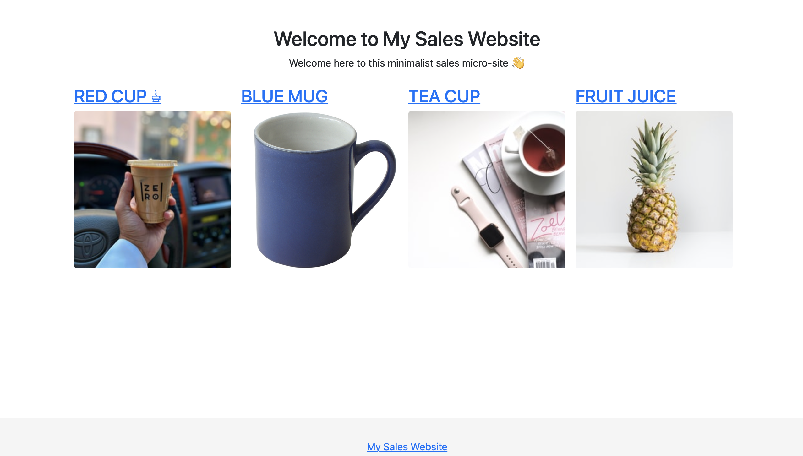

# Minimalist sales micro-site

### A minimalist sales micro-site

*The easiest way to build a micro sales site 🚀*

- [🔨 Requirements](#hammer-requirements)
- [💭 Setup](#thought_balloon-setup)
- [🎉 3rd Party Libraries](#tada-3rd-party-libraries)
- [🧑‍🍳 About](#cook-author)
- [📺 Video](#tv-video)
- [📄 License](#page_with_curl-license)

## :hammer: Requirements

* [PHP 8 or newer](https://www.php.net/releases/8.0/en.php) 🎉
* [Composer](https://getcomposer.org/doc/00-intro.md#introduction) installed on your machine 📦

## :thought_balloon: Setup

* From a command line opened in the project, run `composer install` to install the project dependencies.
* Rename `env.sample` to `.env` and update the details in there.

FYI: The document root file is `index.php` located in the root directory of this project.

## :tada: 3rd party libraries

**This project uses the following awesome libs:**
* [Bootstrap v5](https://github.com/twbs/bootstrap/releases/tag/v5.0.0)
* [Mustache.PHP](https://github.com/bobthecow/mustache.php)
* [Just HTTP Status Codes](https://packagist.org/packages/ph-7/just-http-status-codes)
* [PHP dotenv](https://github.com/vlucas/phpdotenv)

## :cook: Author

I'm **[Pierre-Henry Soria](https://ph7.me)**. A passionate, perseverant zen &amp; dedicated software engineer 😊 **Coding the best applications with the best practices is my way of life! 🌴**

You can keep in touch with me at: *hi@ph7.me* 📮

[![pH-7][github-image]](https://github.com/pH-7 "Follow Me on GitHub") [![@phenrysay][twitter-image]](https://twitter.com/phenrysay "Follow Me on Twitter")

---

## :tv: Video

👉 **[Click here to watch on YouTube](https://www.youtube.com/watch?v=4OzD_agPFLA)**

## :page_with_curl: License

**Minimalist sales micro-site** is distributed under [MIT](https://opensource.org/licenses/MIT) license 🚀 Enjoy! ❤️

<!-- GitHub's Markdown reference links -->
[github-image]: https://img.shields.io/badge/GitHub-100000?style=for-the-badge&logo=github&logoColor=white
[twitter-image]: https://img.shields.io/badge/Twitter-1DA1F2?style=for-the-badge&logo=twitter&logoColor=white

<!-- Was generated by README Generator CLI on 2021-12-25 https://github.com/pH-7/github-readme-generator-cli -->
